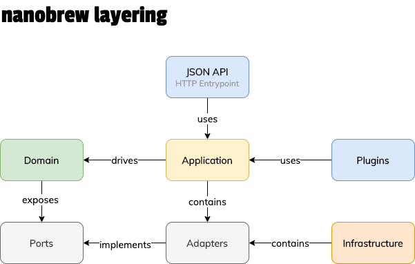

# Architecture

## Nanobrew core & plugins

The Nanobrew core is intentionally limited in functionality. It's meant to
provide a strong, solid and reliable base to base plugins on. This is why
there's quite a bit of abstraction going on in the core, so that we can add
to it while not breaking existing plugins. Nobody wants versioning hell, and
nobody wants a new rebuild of the software every two years.

### Commands, events, queries

Both plugins and the JSON API can communicate with the core of nanobrew
through commands, events, and queries:

- *Commands* are state changing operations, used to change the application
state (e.g. adding a sensor or changing configuration);
- *Events* are notifications of something that has happened (e.g. sensor
value changed);
- *Queries* are a named ways of retrieving data from nanobrew (e.g. a list of
all kettles);

### Layering

To abstract away the core of nanobrew of how it is used, we use a certain way
of layering that is probably familiar for anyone who has ever read anything
about [hexagonal architecture](hexagonal-architecture).

A simple summary, logic is kept in the domain and the domain has no
dependencies on other layers. The domain exposes interfaces, also known as
"ports". The other layers (infrastructure and application) offer concrete
implementations of these interfaces, also known as "adapters".

As a concrete example, the domain exposes a port "sensor data mapper", which
has no concrete implementation. The infrastructure layer contains an adapter
called "sqlite data mapper", which does contain a concrete implementation.
Injecting the concrete implementation when needed is the responsibility of
the dependency injection container.

### Concepts

#### Repositories

Repositories are where collections of domain entities are maintained in
memory. Each repository contains a data mapper to communicate with persistant
storage.

#### Data mapper

A data mapper is responsible for storing domain entities in a persistent
storage, in ourcase generally SQLite.

#### Mapper

A mapper is an object that can convert a domain entity into a native python
structure (such as a dict) and vice versa.

[hexagonal-architecture]: https://en.wikipedia.org/wiki/Hexagonal_architecture_(software)