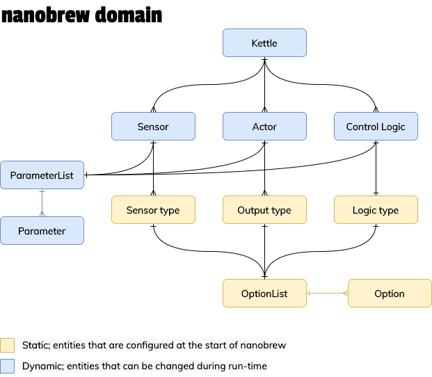

# Domain Terminology

## Sensor

A sensor represents an actual sensor. It contains the sensor ID, name and
parameters, but relies on its sensor type to read the sensor values.

## Sensor type

A sensor type determines how a sensor is read. This sensor type defines
options that can be used to configure the sensor.

## Actor

Ultimately, an actor is something that can be toggled on or off. It contains
the actor ID, its name, parameters, and a reference to the actor output. The
latter does the actual switching on and off.

## Actor output

An actor output determines how the actor is toggled on or off. The output
type defines options that can be used to configure the actor.

## Kettle

A kettle is an aggregate of actors, sensors and a control logic.

## Control logic

A control logic contains the logic to control the temperature of a kettle.

## Options and parameters

Sensor types, actor outputs, and heating logics need configuration to do
their jobs. This configuration is handled by two related but seperated
concepts: options and parameters.

Options represent the blueprints of the configuration: a DS18B20 temperature
sensor needs an address to function, so it has an option called "address".
The option has possible values, which are the actual addresses found on the
file system.

A *parameter* is the concrete value of an option; Sensor X has sensor type
"DS18B20" and parameter "address" is set to "7863r7yfsiy". The read method
of the sensor will receive parameters and can then return the value for that
specific address.